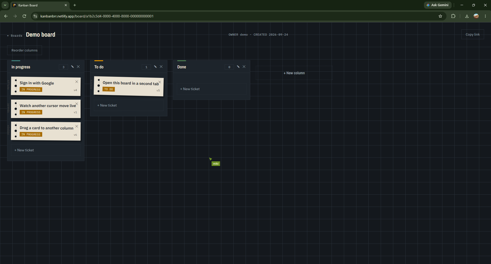
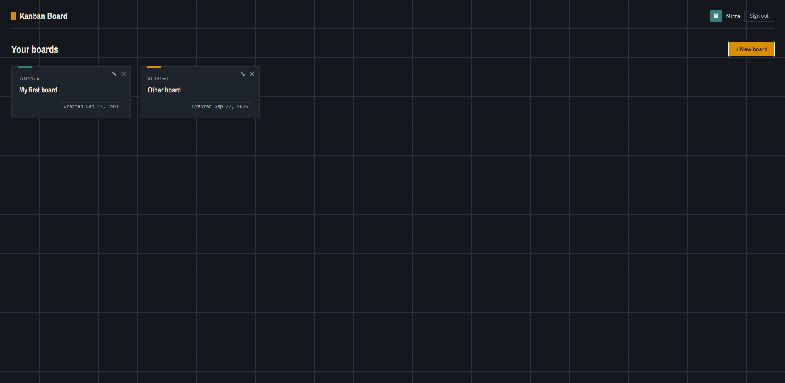

# Kanban Board

A real-time collaborative kanban board built to demonstrate CQRS, optimistic concurrency, and live multiplayer sync, the kind of problems a real team tool actually has to solve, not just another CRUD app.

**[Live Demo](https://kanbanbrr.netlify.app/)** · **[Try the demo board](https://kanbanbrr.netlify.app/board/a1b2c3d4-0000-4000-8000-000000000001)** no sign-in required



## What this is

A Trello-style board where multiple people can open the same board, drag cards around, edit them, and see each other's changes and cursors instantly, including what happens when two people edit the same card at the same time.

Built as a portfolio project, so the README leads with the interesting engineering decisions rather than a feature list. The "war story" is optimistic concurrency: see [Handling Concurrent Edits](#handling-concurrent-edits-the-core-problem) below.

## Features

- **Boards, columns, cards** - full CRUD, drag-and-drop reordering and moving between columns
- **Real-time sync** - every client sees changes from other users instantly via SignalR
- **Live cursors & presence** - see who else is viewing the board and where their cursor is
- **Optimistic concurrency control** - conflicting edits are rejected with a clear message instead of silently overwriting each other
- **Auth** - Google OAuth for board owners, anonymous guests via share link
- **Guest collaboration** - anyone with a share link can join and edit without creating an account
- **Demo board** - a public, always-available board so reviewers don't need to sign in

## Tech Stack

**Backend:** ASP.NET Core Web API (.NET 10) · MediatR (CQRS) · EF Core · PostgreSQL · FluentValidation · SignalR · JWT + Google OAuth

**Frontend:** Angular (zoneless, no zone.js) · TypeScript · SCSS · Angular CDK (Dialog, Drag & Drop) · `@microsoft/signalr`

## Architecture

```
Angular (zoneless)  ──REST + SignalR──►  ASP.NET Core API
                                              │
                                          MediatR (CQRS)
                                              │
                                          EF Core ──► PostgreSQL
                                              │
                                          SignalR Hub ──► connected clients
                                          (card/column events, presence, cursors)
```

- **CQRS with MediatR**: writes are small, validated commands; reads return a full board shape (columns + cards + presence). The two genuinely have a different shape, which is the actual justification for CQRS here — not applied everywhere by default.
- **Feature-based structure** (`Features/{Entity}/Commands|Queries/{Action}`) on the backend, mirrored on the frontend (`api-services/{entity}/`), so a change to one entity touches one folder, not four.
- **DTOs, not entities, over the wire** — avoids circular references (`Board → Columns → Column → Board`) and lets each endpoint shape data exactly as its consumer needs it.

## Handling Concurrent Edits (the core problem)

This is the part I'd want to be asked about in an interview.

Two people can open the same card at the same time. Without protection, the second save silently overwrites the first person's work and they never find out. The fix is a `Version` field on `Card`, treated as an [EF Core concurrency token](https://learn.microsoft.com/en-us/ef/core/saving/concurrency):

1. The client always sends back the last `Version` it saw.
2. EF Core generates `UPDATE ... WHERE Id = @id AND Version = @lastSeenVersion`.
3. If another edit already changed the row, zero rows match → EF Core throws `DbUpdateConcurrencyException` → the API returns `409 Conflict`.
4. The client shows *"This card was changed by someone else"* instead of silently losing data.

There are two layers of protection, deliberately: an application-level `if` check gives a clean error message, and the database-level concurrency token is the actual guarantee — it holds even if the check is ever bypassed.

The same mechanism protects `MoveCardCommand` (drag & drop): only the card being moved has its version bumped, and its neighbors only have their `Order` adjusted — a side effect is that a concurrent edit to a neighboring card's order can also trigger a 409, which is the correct behavior, not a bug.

**Tested end-to-end, not just in a unit test:** opened the same board in two tabs, edited the same card in both, first save succeeds, second returns a conflict instead of overwriting.

## Other notable decisions

- **`Order` is always computed server-side**, never trusted from the client — a client-supplied order can create duplicates or gaps. Create uses `max + 1`; Move renumbers the affected column to `0..n-1`.
- **Column rename and column reorder are separate commands** — `Order` is a property of the whole set of columns, not one column, so a single-row update can't safely express a reorder.
- **`OwnerId` always comes from the JWT, never from the request body** — the controller overwrites whatever the client sends, and `ListBoardsQuery` filters by the token's identity. A client can't create a board in someone else's name or read someone else's board list.
- **Authorization lives in the handler, not just `[Authorize]` on the controller** — `[Authorize]` establishes *who*, the handler's `OwnerId != RequesterId` check establishes *what they're allowed to do*. The null-check runs before the ownership check, so a missing board returns 404 (not a 500, and not a 403 that would leak whether the board exists).
- **Guests get no JWT at all** — a guest's identity exists only inside a SignalR connection (name passed to `JoinBoard`), so there's no server-side guest user table to manage.
- **SignalR auth via `access_token` query string**, not an `Authorization` header — the browser's WebSocket API doesn't allow custom headers on the handshake, so query string is the standard pattern for SignalR JWT auth.
- **Global exception handler + ProblemDetails** — domain exceptions (`NotFoundException`, `ConflictException`, `ForbiddenException`) are thrown from handlers and mapped to HTTP status codes in exactly one place.

## Visual Design

A "dispatch board" concept — Kanban's real origin is Toyota's factory signal cards, so cards are styled as paper work tickets: dark industrial background, sharp corners, hard offset shadows, perforated card edges, monospace type for functional data (ID, version, timestamp).

| Board view | 
|---|
| 

## Running Locally

```bash
git clone https://github.com/mirza-z/KanbanBoard.git
cd KanbanBoard

# Backend
cd KanbanBoardApi
dotnet user-secrets set "ConnectionStrings:DefaultConnection" "<your-postgres-connection-string>"
dotnet user-secrets set "Jwt:Secret" "<at-least-32-random-characters>"
dotnet user-secrets set "Google:ClientId" "<your-google-oauth-client-id>"
dotnet ef database update
dotnet run

# Frontend (separate terminal)
cd kanban-board-client
npm install
ng serve
```

The API expects a PostgreSQL instance; the connection string, JWT secret, and Google OAuth client ID are read from .NET User Secrets locally and from environment variables in production — never committed to `appsettings.json`.

## Known Limitations
> Note: the API is hosted on a free tier and may take 30–60s to wake up on first load.

Deliberate scope decisions for a portfolio project, not oversights:

- **Order can race under simultaneous creates** — two concurrent create requests can compute the same `max + 1`. A unique index or transaction would close this; not worth the complexity here.
- **Two simultaneous moves within the same column can produce a duplicate `Order`**, since neither move bumps the other's version. The SignalR broadcast + refetch corrects it quickly.
- **JWT has no refresh token** (7-day expiry, by design) — simplest thing that works for a portfolio scope; the interceptor logs the user out cleanly on a 401 rather than leaving them on an error.
- **Column/Card endpoints are open to anyone who knows the GUID** — intentional, since the share-link model requires guests to be able to edit without an account. There's no per-board access control beyond the board GUID itself.
- **The demo board is publicly editable** — reset periodically rather than protected, so it stays usable as a live example.
- **Presence tracking is in-memory** — works for a single server instance; a multi-instance deployment would need a shared backplane (e.g. Redis) for SignalR.


